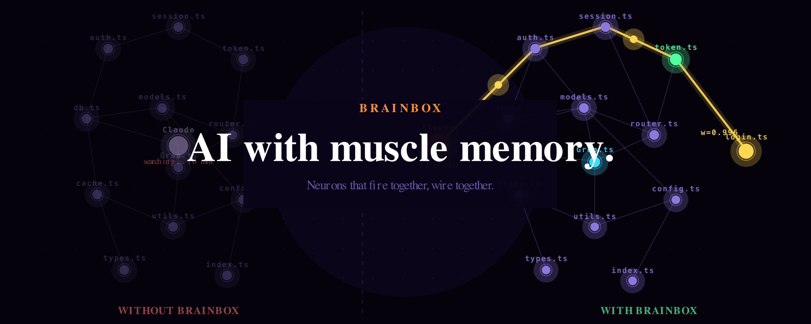

# BrainBox

<p align="center">
  
</p>

<p align="center">
  <a href="https://www.npmjs.com/package/brainbox-hebbian"></a>
  <a href="https://github.com/thebasedcapital/brainbox/stargazers"></a>
  <a href="https://github.com/thebasedcapital/brainbox/blob/main/LICENSE"></a>
</p>

Hebbian memory for AI coding agents. Learns which files you access together, which errors lead to which fixes, and which tool chains you use most — then recalls them instantly.

**Not a vector database. Not RAG. Procedural memory.**

> If BrainBox saved you tokens, [give it a star](https://github.com/thebasedcapital/brainbox) — it helps others find it.
> Built by [@thebasedcapital](https://x.com/thebasedcapital)

```
Session 1:  agent greps for auth.ts, reads it, edits it (2000 tokens)
Session 5:  agent recalls auth.ts directly, skips search (500 tokens saved)
Session 20: auth.ts is a superhighway — instant recall, zero search cost
```

## Install

```bash
npm install brainbox-hebbian
```

That's it. The postinstall script automatically:
1. Adds `PostToolUse` hook to `~/.claude/settings.json` (learns from every file read/edit/search)
2. Adds `UserPromptSubmit` hook (injects neural recall into prompts automatically)
3. Registers the MCP server via `claude mcp add` (6 tools for manual recall/recording)
4. Creates `~/.brainbox/` database directory

BrainBox learns passively from your next Claude Code session. No configuration needed.

### What does NOT happen automatically

The **macOS daemon** (system-wide FSEvents file watcher) is completely separate and opt-in:

```bash
# Only if you want BrainBox to learn from VS Code, Xcode, vim, shell, etc.
brainbox daemon install   # installs LaunchAgent, starts watching
brainbox daemon status    # check if running
brainbox daemon uninstall # remove completely
```

The daemon watches file changes across all your editors — not just Claude Code. It requires explicit opt-in because it registers a LaunchAgent and monitors your configured project directories.

### Uninstall

```bash
brainbox uninstall  # removes hooks + MCP server, preserves database
```

### Seed from git history (recommended)

Kill cold start by bootstrapping from your existing git history:

```bash
brainbox bootstrap --repo /path/to/project --imports
```

This seeds the neural network from git commit co-changes and import graphs so BrainBox starts with knowledge instead of from zero.

## How It Works

BrainBox implements neuroscience-inspired learning:

- **Neurons** — files, tools, and errors you interact with
- **Synapses** — connections formed when things are accessed together ("neurons that fire together wire together")
- **Myelination** — frequently-used paths get faster (like muscle memory)
- **Spreading activation** — recalling one file activates related files
- **Decay** — unused connections weaken naturally, keeping the network clean

<details>
<summary><strong>Hebbian Learning in Action</strong> (click to play)</summary>

https://github.com/thebasedcapital/brainbox/raw/main/assets/brainbox-animation.mp4

</details>

<details>
<summary><strong>Spreading Activation</strong> — recalling one file activates related files through synaptic connections</summary>

https://github.com/thebasedcapital/brainbox/raw/main/assets/brainbox-spreading.mp4

</details>

<details>
<summary><strong>Superhighway Formation</strong> — frequently-used pathways become instant-recall superhighways</summary>

https://github.com/thebasedcapital/brainbox/raw/main/assets/brainbox-superhighway.mp4

</details>

<details>
<summary><strong>Error-Fix Immune System</strong> — remembers which files fixed which errors</summary>

https://github.com/thebasedcapital/brainbox/raw/main/assets/brainbox-immune.mp4

</details>

## Other Integrations

### MCP Server (any agent)

If you're not using Claude Code, you can run the MCP server standalone:

```bash
# 6 tools: record, recall, error, predict_next, stats, decay
npx tsx node_modules/brainbox-hebbian/src/mcp.ts
```

### Kilo / OpenCode (native plugin)

Add to `~/.config/kilo/config.json`:

```json
{
  "plugin": ["node_modules/brainbox-hebbian/src/kilo-plugin.ts"]
}
```

### OpenClaw (NeuroVault)

BrainBox can be deployed as an OpenClaw memory slot plugin. See [NeuroVault](https://github.com/thebasedcapital/neurovault) for the reference implementation.

| Aspect | Claude Code | OpenClaw |
|---|---|---|
| Tool names | PascalCase (`Read`) | Lowercase (`read`) |
| Context injection | `UserPromptSubmit` hook | `before_agent_start` lifecycle |
| Learning trigger | `PostToolUse` hook | `after_tool_call` lifecycle |
| Embeddings | all-MiniLM-L6-v2 | Keyword-only (lower confidence gate) |

## CLI

```bash
brainbox recall "authentication login"
brainbox record src/auth.ts --context "authentication"
brainbox stats
brainbox error "TypeError: cannot read 'token'"
brainbox predict Read
brainbox embed          # add vector embeddings for semantic recall
brainbox hubs           # most connected neurons
brainbox stale          # decaying superhighways
brainbox projects       # list project tags
brainbox sessions       # recent sessions with intents
brainbox streaks        # anti-recall ignore streaks
brainbox graph          # ASCII neural network
brainbox highways       # show superhighways
brainbox decay          # weaken unused connections
```

## Key Features

### Hebbian Learning
Files accessed together form synapses. Access `auth.ts` then `session.ts` 10 times and BrainBox learns they're related — recalling one activates the other.

### Error-Fix Immune System
When you fix a bug, BrainBox remembers which files fixed which errors. Next time a similar error appears, it suggests the fix files immediately.

### Tool Sequence Prediction
After 20 Grep-Read-Edit chains, BrainBox predicts you'll Read after Grep and pre-loads likely files.

### SNAP Plasticity
Strong synapses resist further strengthening (like real neural synapses). Prevents any single connection from dominating the network.

### Anti-Recall Escalation
Files recalled but never opened get progressively stronger decay. Consecutive ignores escalate: 1st = 10%, 2nd = 19%, 3rd = 27%. Opening the file resets the streak.

### Hub Detection & Staleness Alerts
Identify the most-connected neurons in your network and detect decaying superhighways before they fade.

### Project Tagging
Auto-tag file neurons by project. Recall scoped to current project reduces cross-project noise.

## Architecture

```
src/
  hebbian.ts     # Core engine: record, recall, decay, SNAP, BCM, spreading activation
  db.ts          # SQLite schema: neurons, synapses, access_log, sessions
  embeddings.ts  # Optional vector embeddings (all-MiniLM-L6-v2, 384 dims)
  installer.ts   # Auto-installer: adds hooks + MCP to ~/.claude/settings.json
  mcp.ts         # MCP server (6 tools)
  hook.ts        # Claude Code PostToolUse hook
  prompt-hook.ts # Claude Code UserPromptSubmit hook
  kilo-plugin.ts # Kilo/OpenCode native plugin
  bootstrap.ts   # Git/vault/import seeder
  daemon.ts      # FSEvents file watcher (macOS, opt-in)
  cli.ts         # CLI interface
  test.ts        # 59 tests, all passing
```

## Algorithm Details

| Component | Mechanism |
|-----------|-----------|
| Synapse formation | Sequential window (25 items), positional decay |
| Strengthening | SNAP sigmoid plasticity (midpoint 0.5, steepness 8) |
| Myelination | BCM sliding threshold + diminishing returns, 0.95 ceiling |
| Confidence | Multiplicative: contextScore * (1 + myelin + recency + path) |
| Spreading | 2-hop BFS, fan-out cap 10, fan effect 1/sqrt(degree) |
| Decay | Activation -15%, synapses -2%, myelination -0.5% per cycle |
| Error learning | 2x boosted learning rate for error neurons |
| Anti-recall | Compound decay: `1 - (1 - 0.1)^streak`, floor at 0.1 |

Full details in [WHITEPAPER.md](./WHITEPAPER.md).

## Tests

```bash
npm test  # 59 tests, ~2s
```

## Requirements

- Node.js 18+
- macOS or Linux (FSEvents daemon is macOS-only, everything else is cross-platform)

## License

MIT
